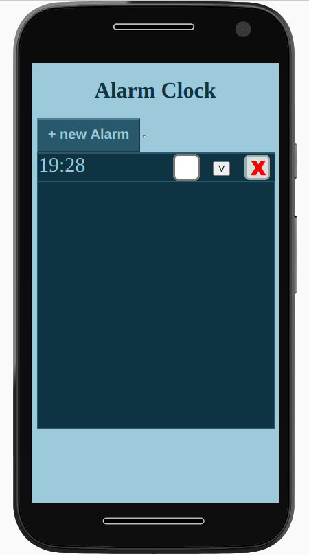

# PhoneGap App: Alarm Clock

PhoneGap app that connects via bluetooth to multiple small vibrating devices. This app is a basic implementation of an alarm clock. When the added alarm goes down the connected devices start vibrating. The vibrating intesity increases as time passes till the alarm is put off.

## Usage

This is a mobile app. You need PhoneGap installed on your PC and your (android) mobile phone. On your PC start a PhoneGap server and insert the id of your server in PhoneGap on your mobile phone. Connect the hardware via bluetooth. This only works with the corresponding hardware. Open the app and add an alarm. Wait till it goes down. The devices should start vibrating.

If you don't have an android mobile phone you can still open the /www/index.html in your browser. But this way you cannot test the functions of the app.

